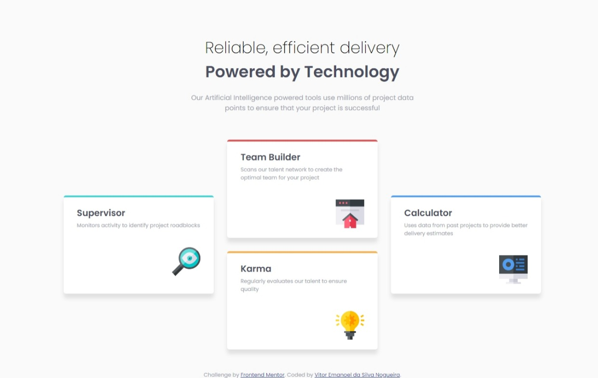

# Frontend Mentor - Four card feature section solution

This is a solution to the [Four card feature section challenge on Frontend Mentor](https://www.frontendmentor.io/challenges/four-card-feature-section-weK1eFYK). Frontend Mentor challenges help you improve your coding skills by building realistic projects. 

## Table of contents

- [Overview](#overview)
  - [The challenge](#the-challenge)
  - [Screenshot](#screenshot)
  - [Links](#links)
- [My process](#my-process)
  - [Built with](#built-with)
  - [What I learned](#what-i-learned)
  - [Continued development](#continued-development)
- [Author](#author)

## Overview

### The challenge

Users should be able to:

- View the optimal layout for the site depending on their device's screen size

### Screenshot



### Links

- Solution URL: [Add solution URL here](https://your-solution-url.com)
- Live Site URL: [Add live site URL here](https://your-live-site-url.com)

## My process

### Built with

- Semantic HTML5 markup
- CSS custom properties
- Flexbox
- CSS Grid
- Mobile-first workflow

### What I learned

Finally got my knowledge of CSS GRID in use and used the pseudo-class nth-child.

```css
div.card:nth-child(2){
    border-color: var(--red);
}

div.card:nth-child(3){
    border-color: var(--orange);
}

div.card:nth-child(4){
    border-color: var(--blue);
}

section.container{
        display: grid;
        grid-template-columns: 1fr 3fr 3fr 3fr 1fr;
        grid-template-rows: 1fr 1fr 1fr 1fr;
        gap: 3em;
    }

    div.card{
        grid-area: 2 / 2 / 4 / 3;
        margin: 0rem;
    }
    
    div.card:nth-child(2){
        grid-area: 1 / 3 / 3 / 4;
    }
    
    div.card:nth-child(3){
        grid-area: 3 / 3 / 5 / 4;
    }
    
    div.card:nth-child(4){
        grid-area: 2 / 4 / 4 / 5;
    }
```

### Continued development

I will continue focusing on using the GRID layout on my projects.

## Author
- Frontend Mentor - [@VitorEmanoelNogueira](https://www.frontendmentor.io/profile/VitorEmanoelNogueira)